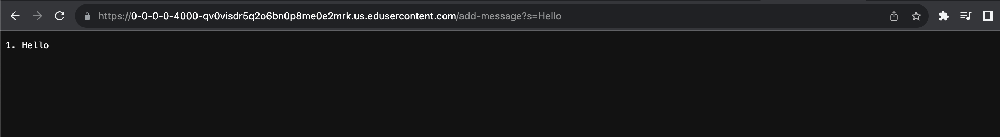
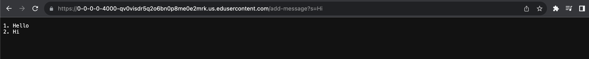
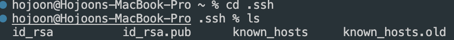
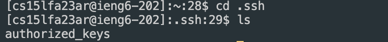
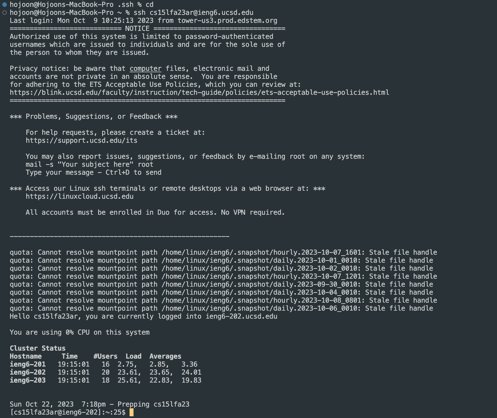

Part 1

```
import java.io.IOException;
import java.net.URI;
import java.util.ArrayList;
import java.util.List;

class Handler implements URLHandler {
    List<String> messages = new ArrayList<>();
    int num = 1;

    public String handleRequest(URI url) {
        if (url.getPath().equals("/")) {
            return String.join("N/A", messages);
        } else if (url.getPath().contains("/add-message")) {
            String[] parameters = url.getQuery().split("s=");

            if (parameters.length == 2) {
                String message = parameters[1];
                String fMessage = num + ". " + message;
                messages.add(fMessage);
                num++;
                return String.join("\n", messages);
            }
        }
        return "404 Not Found";
    }
}

class StringServer {
    public static void main(String[] args) throws IOException {
        if(args.length == 0) {
            System.out.println("Missing port number! Try any number between 1024 to 49151");
            return;
        }

        int port = Integer.parseInt(args[0]);

        Server.start(port, new Handler());
    }
}
```


1. Methods Called: A GET request is made to /add-message?s=Hello.
   
2. Relevant Arguments: The request URL contains the query parameter s=Hello.
   
3. Values of Relevant Fields:
array messages is initially an empty array.
num is initially 1. This is changed by num++ in the file.
Change in Relevant Fields: After this specific request, messages contain the string "1. Hello\n" and the num is incremented to 2.


Screenshot 2: Adding "How are you"

Methods Called: A GET request is made to /add-message?s=Hi.

Relevant Arguments: The request URL contains the query parameter s=Hi.

Values of Relevant Fields:

messages contain "1. Hello\n".
num is 2.
Change in Relevant Fields: After this specific request, messages contain "1. Hello\n 2. Hi\n" and num is incremented to 3.

Part2



