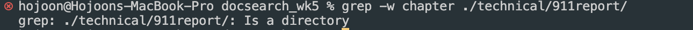

Part 1

A failure-inducing input for the buggy program, as a JUnit test and any associated code

```
@Test
  public void testReversedinput(){
    int[] input = {1,2,3};
    assertArrayEquals(new int[]{ 3,2,1 }, ArrayExamples.reversed(input));
  }
```

```
static void reverseInPlace(int[] arr) {
    for(int i = 0; i < arr.length; i += 1) {
      arr[i] = arr[arr.length - i - 1];
    }
  }
```

An input that doesn’t induce a failure, as a JUnit test and any associated code

```
@Test
  public void testReversedinput(){
    int[] input = {1,2,3};
    assertArrayEquals(new int[]{ 3 }, ArrayExamples.reversed(input));
  }
```

```
static void reverseInPlace(int[] arr) {
    for(int i = 0; i < arr.length; i += 1) {
      arr[i] = arr[arr.length - i - 1];
    }
  }
```

The symptom, as the output of running the tests


The bug, as the before-and-after code change required to fix it

before
```
static void reverseInPlace(int[] arr) {
    for(int i = 0; i < arr.length; i += 1) {
      arr[i] = arr[arr.length - i - 1];
    }
  }
```

After
```
// Changes the input array to be in reversed order
  static void reverseInPlace(int[] arr) {
    for(int i = 0; i < arr.length/2; i += 1) {
      int temp = arr[i];
      arr[i] = arr[arr.length - i - 1];
      arr[arr.length - i - 1] = temp;
    }
  }
```

This is because the before code it keeps does not swap the elements, it saves the arr[arr.length - i - 1] to arr[i] without returning arr[i] value to arr[arr.length - i - 1].
So, if we save arr[arr.length - i - 1] value to temp and return it to arr[i], the problems will be solved.

Part 2
I chose grep and command examples.

1. '-i' command
```
grep -i flights ./technical/911report/chapter-1.txt
```


-i (ignore-case): Ignores case distinctions in patterns and input data. This searches for word flights that is in the file and show output.
```
grep -i chapter ./technical/911report/
```

-i (ignore-case): Ignores case distinctions in patterns and input data. This is used in directory not file so it shows that given is directory.

```
grep -w flights ./technical/911report/chapter-1.txt
```

-w (word-regexp): Finds the exact matching word from the input file or string.

```
grep -w chapter ./technical/911report/
```

-w (word-regexp): Finds the exact matching word from the input file or string. Returns that it is directory.

```
grep -v we ./technical/911report/chapter-1.txt
```

-v (invert-match): Selects the non-matching lines of the provided input pattern​.

```
grep -v chapter ./technical/911report/
```

-v (invert-match): Selects the non-matching lines of the provided input pattern​. Returns that it is directory.

```
grep -n flights ./technical/911report/chapter-1.txt
```

-n (line-number): Prefix each line of the matching output with the line number in the input file.

```
grep -n chapter ./technical/911report/  
```

-n (line-number): Prefix each line of the matching output with the line number in the input file.  Returns that it is directory.


