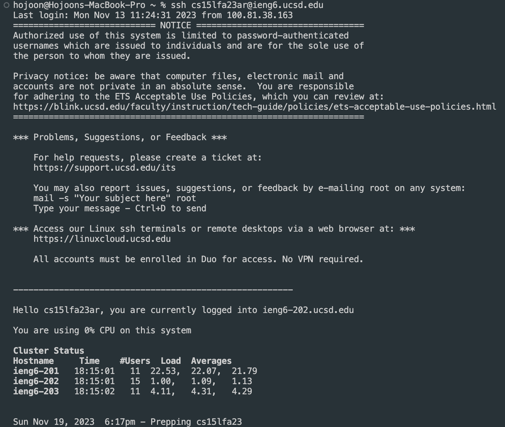
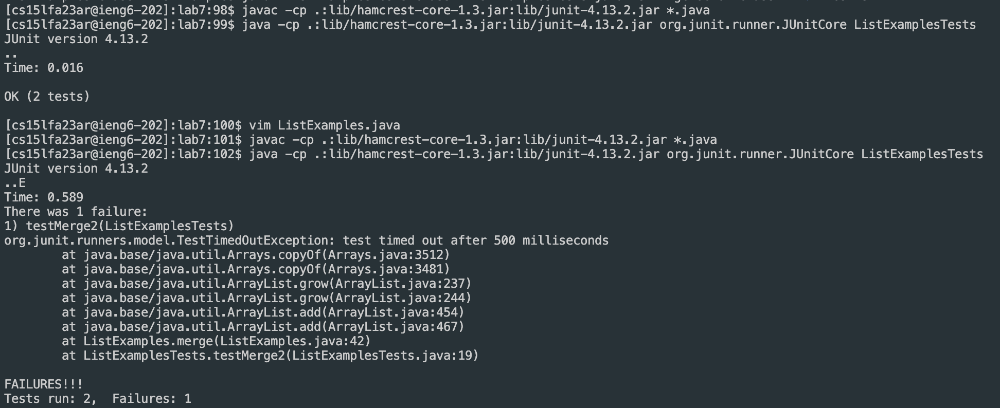
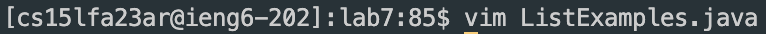
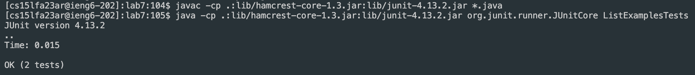

```
ssh cs15lfa23ar@ieng6.ucsd.edu 
```
`<enter>`



This command made me access to remote computer

```
git clone https://github.com/Hjkim118/lab7 
```
`<enter>`


This command made me able to clone https://github.com/Hjkim118/lab7 into remote computer

```
cd lab7
```
`<enter>`



This command changed my directory to lab7 in remote computer directories

```
javac -cp .:lib/hamcrest-core-1.3.jar:lib/junit-4.13.2.jar *.java

java -cp .:lib/hamcrest-core-1.3.jar:lib/junit-4.13.2.jar org.junit.runner.JUnitCore ListExamplesTests
```
`<enter>`



These commmands were for testing with ListExamplesTests.java file if the ListExamples.java had no errors.

```
vim ListExamples.java
```
`<enter>`

This command was for accessing ListExamples.java file to see the code and edit if there is wrong lines.

```
j*43 l*11 x i 2 <esc> :wq! <enter>
```
`<j>` `<j>` `<j>` `<j>` `<j>` `<j>` `<j>` `<j>` `<j>` `<j>` `<j>` `<j>` `<j>` `<j>` `<j>` `<j>` `<j>` `<j>` `<j>` `<j>` `<j>` `<j>` `<j>` `<j>` `<j>` `<j>` `<j>` `<j>` `<j>` `<j>` `<j>` `<j>` `<j>` `<j>` `<j>` `<j>` `<j>` `<j>` `<j>` `<j>` `<j>` `<j>` `<j>`
`<l>` `<l>` `<l>` `<l>` `<l>` `<l>` `<l>` `<l>` `<l>` `<l>` `<l>` `<x>` `<i>` `<2>` `<esc>` `<:wq!>` `<enter>`

Pressed `<j>` 43times to go down until the line that had error and `<l>` to go right to sepcify the place I want to fix. Pressed `<x>` for deleting 1, and pressed `<i>` and `<2>` to insert 2 in that place.
Then I pressed `<esc>` to finish editing and pressed `<:wq!>` to exit with saved changes.


`<up>` 3 `<enter>`
```
up 3 <enter>
```




Pressed up-arrow 3 times to find history of code which I typed javac -cp .:lib/hamcrest-core-1.3.jar:lib/junit-4.13.2.jar *.java
Pressed up-arrow 3 times again to find java -cp .:lib/hamcrest-core-1.3.jar:lib/junit-4.13.2.jar org.junit.runner.JUnitCore ListExamplesTests

```
git add ListExamples.java
```


Added changed ListExamples.java to git.
