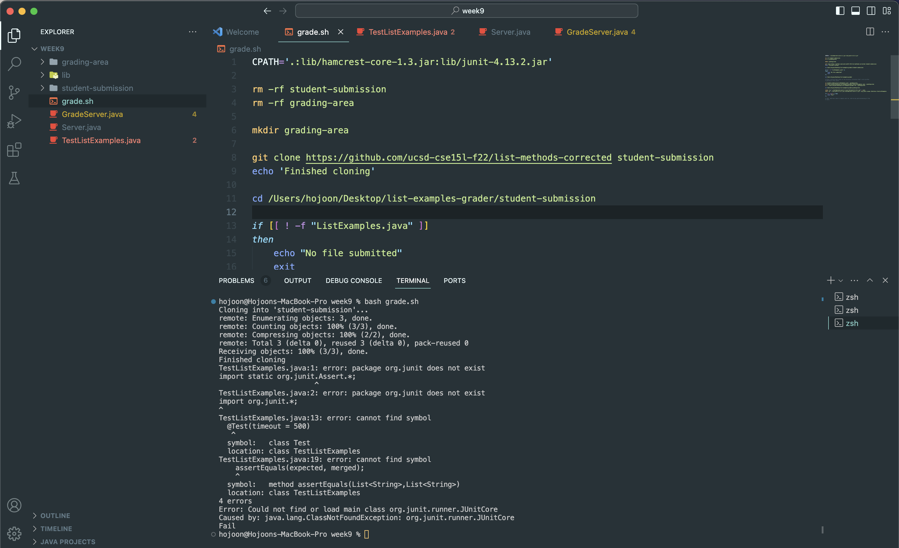
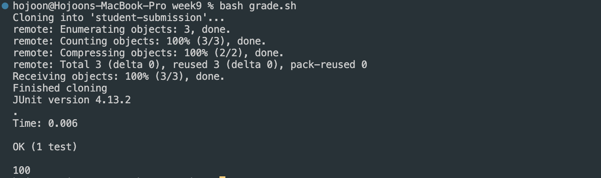

Part 1

<ins>Original Post by Student:</ins>

Dear TA,

Hello, I'm trying to run my Java program using a bash script, but it's not working as expected. I've attached a screenshot of the error message I'm getting in the terminal.



I used the code given in week 4 for junit but it shows the error that org.junit does not exist. 
Could you please help me figure out what's going wrong?

Thank you.

<ins>Response from TA:</ins>

Hi,

Looking through your code, there is no error and it seems that there is some error with your computer or code line that has junit code.

Here are some suggestions:
1. Please look over the code that has junit carefully. There might have been a typo.
2. Look if the code matches you system. In week 4, we have given the two versions, one for window and mac. See if you have correct code lines in the code.

Please look through these two, and let me know if there are other problems.

Thanks!

<ins>Responese from Student:</ins>

Hi,
I have figured out that I was running the given code for Windows while I am using MAC right now. It works fine right now.

Thank you!

Files and Directory structures
grade.sh
GradeServer.java
Server.java
TestListExamples.java
lib(folder)
 - hamcrest-core-1.3.jar
 - junit-4.13.2.jar

Before Fixing bugs

<ins>grade.sh</ins>

```
CPATH='.:lib/hamcrest-core-1.3.jar:lib/junit-4.13.2.jar'

rm -rf student-submission
rm -rf grading-area

mkdir grading-area

git clone https://github.com/ucsd-cse15l-f22/list-methods-corrected student-submission
echo 'Finished cloning'

cd /Users/hojoon/Desktop/list-examples-grader/student-submission

if [[ ! -f "ListExamples.java" ]]
then
    echo "No file submitted"
    exit
fi

cd /Users/hojoon/Desktop/list-examples-grader
cp student-submission/ListExamples.java ./grading-area
cp /Users/hojoon/Desktop/list-examples-grader/TestListExamples.java ./grading-area
cp -r /Users/hojoon/Desktop/list-examples-grader/lib ./grading-area

cd /Users/hojoon/Desktop/list-examples-grader/grading-area

javac -cp ".;lib/hamcrest-core-1.3.jar;lib/junit-4.13.2.jar" *.java
java -cp ".;lib/junit-4.13.2.jar;lib/hamcrest-core-1.3.jar" org.junit.runner.JUnitCore TestListExamples

if [ $? -ne 0 ]; then
    echo "Fail"
fi
```
<ins>GradeServer.java</ins>
```
import java.io.BufferedReader;
import java.io.IOException;
import java.io.InputStream;
import java.io.InputStreamReader;
import java.net.URI;
import java.net.URISyntaxException;
import java.util.Arrays;
import java.util.stream.Stream;

class ExecHelpers {

  /**
    Takes an input stream, reads the full stream, and returns the result as a
    string.

    In Java 9 and later, new String(out.readAllBytes()) would be a better
    option, but using Java 8 for compatibility with ieng6.
  */
  static String streamToString(InputStream out) throws IOException {
    String result = "";
    while(true) {
      int c = out.read();
      if(c == -1) { break; }
      result += (char)c;
    }
    return result;
  }

  /**
    Takes a command, represented as an array of strings as it would by typed at
    the command line, runs it, and returns its combined stdout and stderr as a
    string.
  */
  static String exec(String[] cmd) throws IOException {
    Process p = new ProcessBuilder()
                    .command(Arrays.asList(cmd))
                    .redirectErrorStream(true)
                    .start();
    InputStream outputOfBash = p.getInputStream();
    return String.format("%s\n", streamToString(outputOfBash));
  }

}

class Handler implements URLHandler {
    public String handleRequest(URI url) throws IOException {
       if (url.getPath().equals("/grade")) {
           String[] parameters = url.getQuery().split("=");
           if (parameters[0].equals("repo")) {
               String[] cmd = {"bash", "grade.sh", parameters[1]};
               String result = ExecHelpers.exec(cmd);
               return result;
           }
           else {
               return "Couldn't find query parameter repo";
           }
       }
       else {
           return "Don't know how to handle that path!";
       }
    }
}

class GradeServer {
    public static void main(String[] args) throws IOException {
        if(args.length == 0){
            System.out.println("Missing port number! Try any number between 1024 to 49151");
            return;
        }

        int port = Integer.parseInt(args[0]);

        Server.start(port, new Handler());
    }
}

class ExecExamples {
  public static void main(String[] args) throws IOException {
    String[] cmd1 = {"ls", "lib"};
    System.out.println(ExecHelpers.exec(cmd1));

    String[] cmd2 = {"pwd"};
    System.out.println(ExecHelpers.exec(cmd2));

    String[] cmd3 = {"touch", "a-new-file.txt"};
    System.out.println(ExecHelpers.exec(cmd3));
  }
}
```

<ins>Server.java</ins>

```
import java.io.IOException;
import java.io.OutputStream;
import java.net.InetSocketAddress;
import java.net.URI;

import com.sun.net.httpserver.HttpExchange;
import com.sun.net.httpserver.HttpHandler;
import com.sun.net.httpserver.HttpServer;

interface URLHandler {
    String handleRequest(URI url) throws IOException;
}

class ServerHttpHandler implements HttpHandler {
    URLHandler handler;
    ServerHttpHandler(URLHandler handler) {
      this.handler = handler;
    }
    public void handle(final HttpExchange exchange) throws IOException {
        // form return body after being handled by program
        try {
            String ret = handler.handleRequest(exchange.getRequestURI());
            // form the return string and write it on the browser
            exchange.sendResponseHeaders(200, ret.getBytes().length);
            OutputStream os = exchange.getResponseBody();
            os.write(ret.getBytes());
            os.close();
        } catch(Exception e) {
            String response = e.toString();
            exchange.sendResponseHeaders(500, response.getBytes().length);
            OutputStream os = exchange.getResponseBody();
            os.write(response.getBytes());
            os.close();
        }
    }
}

public class Server {
    public static void start(int port, URLHandler handler) throws IOException {
        HttpServer server = HttpServer.create(new InetSocketAddress(port), 0);

        //create request entrypoint
        server.createContext("/", new ServerHttpHandler(handler));

        //start the server
        server.start();
        System.out.println("Server Started! Visit http://localhost:" + port + " to visit.");
    }
}
```

<ins>TestListExamples.java</ins>
```
import static org.junit.Assert.*;
import org.junit.*;
import java.util.Arrays;
import java.util.List;

class IsMoon implements StringChecker {
  public boolean checkString(String s) {
    return s.equalsIgnoreCase("moon");
  }
}

public class TestListExamples {
  @Test(timeout = 500)
  public void testMergeRightEnd() {
    List<String> left = Arrays.asList("a", "b", "c");
    List<String> right = Arrays.asList("a", "d");
    List<String> merged = ListExamples.merge(left, right);
    List<String> expected = Arrays.asList("a", "a", "b", "c", "d");
    assertEquals(expected, merged);
  }
}
```

for lib folder:

<ins>hamcrest-core-1.3.jar</ins>
```
<dependency>
    <groupId>org.hamcrest</groupId>
    <artifactId>hamcrest-core</artifactId>
    <version>1.3</version>
    <scope>test</scope>
</dependency>
```

<ins>junit-4.13.2.jar</ins>
```
<dependency>
    <groupId>junit</groupId>
    <artifactId>junit</artifactId>
    <version>4.13.2</version>
    <scope>test</scope>
</dependency>
```

<ins>Commands I ran:</ins>
```
bash grade.sh
```
<ins>What to fix</ins>
From:
```
javac -cp ".;lib/hamcrest-core-1.3.jar;lib/junit-4.13.2.jar" *.java
java -cp ".;lib/junit-4.13.2.jar;lib/hamcrest-core-1.3.jar" org.junit.runner.JUnitCore TestListExamples
```

change to:
```
javac -cp .:lib/hamcrest-core-1.3.jar:lib/junit-4.13.2.jar *.java
java -cp .:lib/hamcrest-core-1.3.jar:lib/junit-4.13.2.jar org.junit.runner.JUnitCore TestListExamples
```
The initial code works for Windows users but it shows an error if it is running in MAC. If we change to the latter code above, it works for MAC but not Windows. In this case, the student is running in a MAC environment, where the latter code lines are needed to run the tests.

This error can be easily seen if the student is working in different environments for the same project. So this could be always considered when working on the same project on different OS such as Windows and MAC.

Part 2

Throughout the second half of the quarter, I have learned about bash script and many debug errors that I have encountered due to working on the wrong directory. 
I have learned that to access specific files, I have to be in the correct and exact directories not to have to debug errors.
Also, I have thought of GitHub to be hard to use, especially forking and cloning, but now I am familiar with this and can use it freely in my other works.

